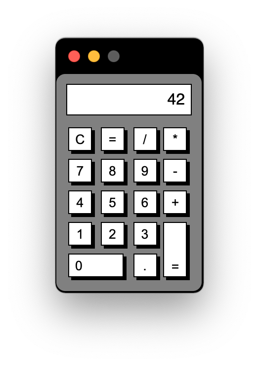

# Vanilla JS Calculator

## Description

A simple calculator written in vanilla JavaScript and HTML, using UIkit for the layout and interface components.

## Deployed

[https://ghall89.github.io/calculator/](https://ghall89.github.io/calculator/)

## Known Issues

- Typing directly into the text input field can break the calculator
- Passing any non-numeral characters will break the calculator
- Layout breaks on mobile (buttons don't shrink correctly)

## Credits

- [UIkit](https://getuikit.com)
